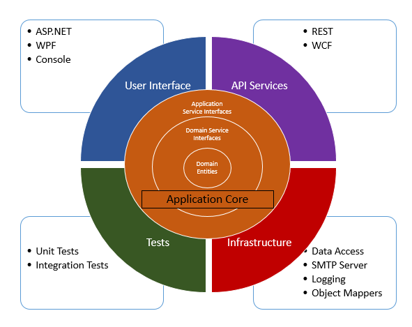
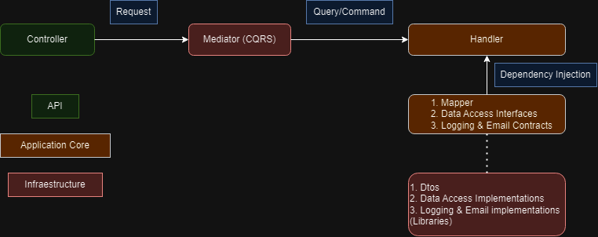

# Net using Clean Architecture rules and CQRS pattern

This course was developed while taking the course: https://www.udemy.com/course/aspnet-core-solid-and-clean-architecture-net-5-and-up, with the objective of consoliditing knowledge in .Net, Clean architecture and understand how CQRS pattern is implemented.

## Application Summary
The functionality of this project is quite simple, it helps managers to have better administration of lead requests, allowing employees to create them, based on available days they have. Once created, the manager can either reject or approve them. Certainly, it's not a production-ready project as it's missing some other critical features, but it works for learning purposes.

## Clean architecture principles
All-in-one architecture: Easier to deliver and stable in a long term solution. However, it becomes harder to test and maintain as the project grows.

Layered architecture: In this architecture, it's a bit easier to work with SOLID principles and easier to maintain in larger code base. However, the layers are dependent, and logic scattered across layers. An example could be:
Web layer: Controllers, exception handlers, templates, etc.
Service Layer: Application services and infra services.
Repository layer: Repository interfaces and their implementations.(Mainly for data access).

Clean architecture: It is based on the layered architecture, with the difference of having more projects, files, and boundaries well defined. The drawbacks of this approach is that the complexity is bigger, therefore the learning curve is higher, and it's definetely more time consuming trying to build a single module.

At this point, If we've been researching about Clean architecture, we've already seen the diagram provided by the uncle bob's blog. It defines four layers:
1. Entities (Enterprise Business Rules): These are the most independant objects we have in our application, so no other dependencies are used here. Most of the time this objects only holds the properties that our application would need. For example, if we have an User Entity, we might need the id, name, etc. In theory, this entity should be independent from the database engine we use, but I'd say it's a bit unfair to say that. If you want to use, for example, postgress, it's very likely that the datatype used for the id would be an int or long. However, if we ended up using MongoDb, we will need to do that change as Mongo uses an internal ObjectId. In my opinion, this advice should be taken with a pinch of salt.
2. Use Cases (Application Business Rules): Then we have the Use Cases. Here, we do all the business logic. Also we should create the contracts needed. These could be data access, a third party service like sending an sms, email, etc. Or our own notification implementation. 
3. Controllers, Presenters, Gateway (Interace Adapters): This is one of the most confusing layers to understand in my opinion. These components are the entry point to our Use cases.
4. Db, Ui, Web, Devices (Framework and drivers): This layer tells us that the UI should not affect any kind of business rule in our application, and even the web platform is not a critical matter in order to design the core of the system. And as I said above, the DB is also another component.

Honestly, I think that the diagram is not very self-explanatory in demostrating the clean architecture principles.

I'd prefer a different approach (which is the one we used in the course) that allows us to understand it better. 

In the Application Core we have:
- Domain Entities
- Domain Service Interfaces
- Application Service Interfaces

Then, layers that not necessarily are possitioned above or below of each other, but independant from each other.
Api Services that might include an .NET core Web API or WCF
User Interface that could be a cli, Blazor, etc.
Tests which could be Unit or Integration tests
And Infrastructure that mostly includes implementations for contracts in the Core 

## Folder Structure
Inside the Zalo.Clean solution we have the *src* and *test* folders, both clearly self-descriptive.
I believe the *test* folder can be improved a bit so it matches the project structure we have in *src*

In src we have 4 folders:
1. API
   This folder stores the ASP.Net Core Web API that defines Controllers, middlewares, models, etc. Everything that every usual web api should have, but instead of having the business logic here, we use it as an entry door to the system. This is one of the most "dirty" projects, as it configures several settings, from the http context (Like cors, authorization, map the controllers, etc). To configure the implementations used by the contracts of our application (each package has this mapping, however we are calling them through extension methods). It almost has references to all projects and does not return any Entities defined in core but DTO's defined in the Infraestructure projects. Additionally, it's responsible to work as a layer between requests to Commands/Queries through the mediator package.
2. Core: Under this folder, we have 2 projects. 
   1. Application: Here, we define the Contracts, Exceptions, Features. Also, we have a mapping file to bind Entities to Dtos
      The most important folder here is the Features folder, which contains the vast majority of the business logic, organized in Commands and Queries. There, using dependency injection, we depend on the contracts defined in this layer instead of implementations. Commands/queries could be seen as "Use cases" in other organizations, however I think we could add them in case we want to separate the CQRS pattern from the business rules, but it would be much boilerplate and not worth it for this project. Each feature holds everything it needs, like Validations files, handler, etc. 
   2. Domain: Entities are stored in this folder. The instructor decided to use the same Domain Entities for Entity Framework. I understand that for the scope of the course, it was the best option. However in large projects, the Entities that map the DB should be different from the entities we have in the core of the application, in my opinion. Thanks that EF doesn't require any dependency or inheritence set up on this entities, we don't need to add a dependency in our Domain.
3. Infrastructure: The implementations defined in Application are created in the infrastructure folder. For example, services details for the "Logging" and "Mailing" services are defined here. Also the persistance layer, which decides what engine or storage mechanism is decided here, it just have to follow the contracts. If you are using EF, you also define the context for the entities you want to use.
4. UI:
   This folder remained empty as in the course the instructor implemented an app with Blazor assembly. I'm not particular interested in learning that tecnology so I just skipped it. However, in this folder we could still put a MVC project or even a html site with its own JS file. In the case of full front-end app like an angular, react, vue project, I'd put it in its own repo, so it doesn't get to heavy and keep things clean.

Note: I just realized that some namespaces start with Zalo.Clean and others with Zalo.LeaveManagment, this last should be the correct prefix, but I don't think it's worth it to do that change now.

## Http Flow 

## Thoughts
- Definitely, this architecture is not suitable for small projects. Even medium projects that are not expected to grow, shouldn't use this rules. It creates a lot of boilerplate and complexity, so, if the requirements aren't too complex, you wouldn't see the benefits of this architecture.
- I wouldn't use Clean architecture for prototyping either.
- In this project, we focused mainly on the backend service. As I mentioned earlier, the front end of your application should reside in another repository, unless you're using an engine template that justifies including the UI here. However, in that project you can also implement Clean Architecture. In fact, you would see a big advantage using it there, as it will help you to strictly separate your UI, with business rules, data from external sources, etc. I've seen this rules widely applied in Flutter projects, but of course, it can be apply in any project with preferably semi-strong typing. 
- When I first heard about CA, I thought that the principles they talk about are static, so you should follow those principles to the letter. But working on personal projects, I realised it's the other way around. You can take these rules guidelines that might help you architect your application better, and anybody familiar with it, can decrease the learning curve in your system. So we still need to use our creativity and experience to build an application that we feel comfortable working with, and at the same time, easy to maintain, debug, and less prone to errors.
- Thanks to the fact that we rely a lot on dependency injection and inversion of control, our code is more testable. I'm not a guru of testing, but I understand this fact in large projects.
- Particularly, in this project we used CQRS to handle every request, but I'm not sure if we should rely 100% of the comunication to this pattern. Certainly, we didn't create other complex scenarios like, background services, webhooks, queuing, file storage, cache, scheduling, localization, etc. Besides CQRS is not limited to map HTTP requests to your Core, the lack of experience using this pattern might lead to an overuse.

